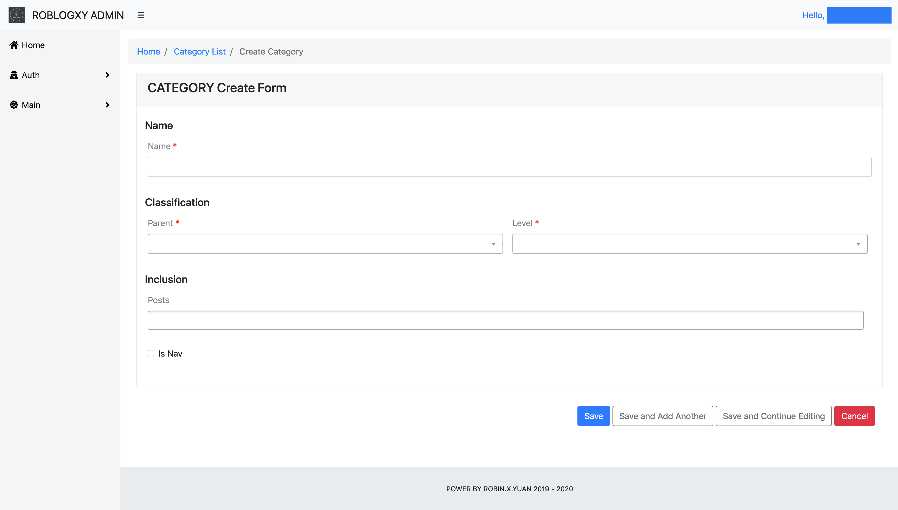

# RoblogXY

This is my personal blog written with Flask.

## Admin Page

I use Flask-Admin Extension to build my back-end administrator platform, with modifying
the user-interfaces and some functions.

### Administrator List Page

### Administrator Create Page

## Blog Page

I use UIKit for beautifying my blog pages.

### Home Page

